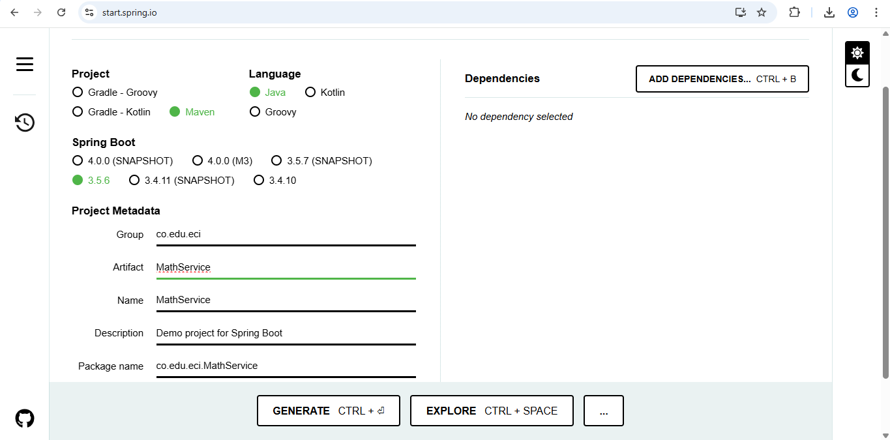
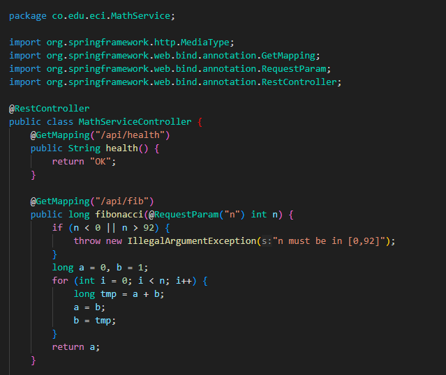
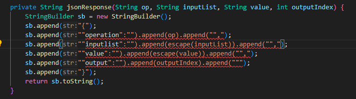
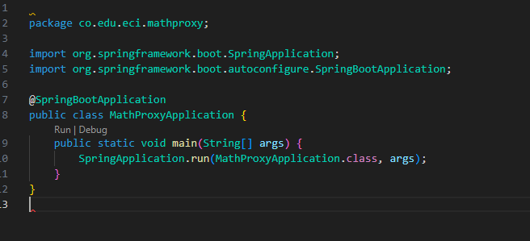
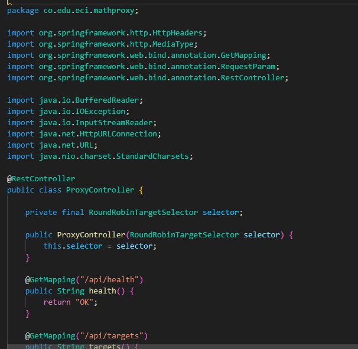
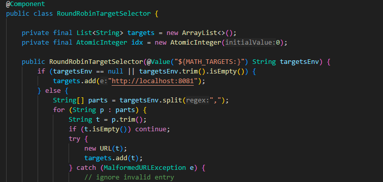
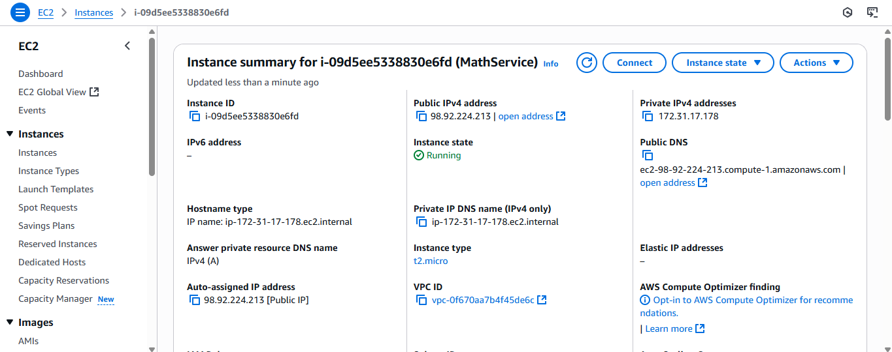
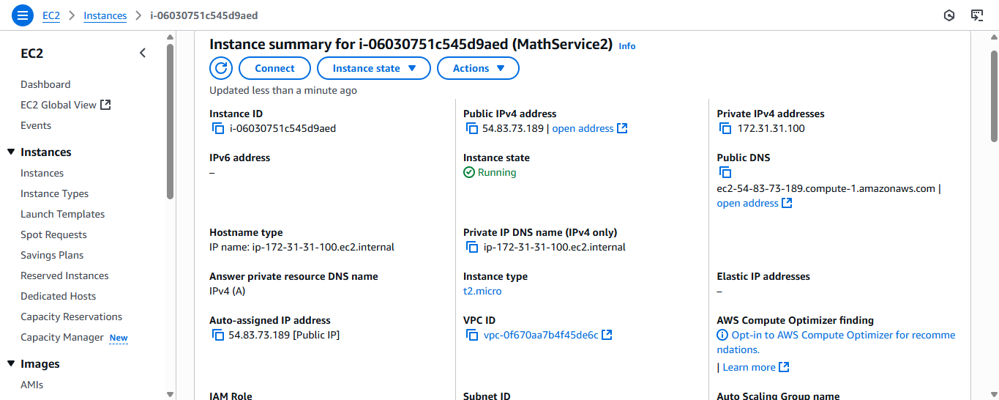

# Parcial Segundo Tercio AREP
 Alexandra Moreno Latorre

 Profesor: Luis Daniel Benavides Navarro


###  Enunciado 
El problema matemático que debo resolver es:

Funciones de ordenamiento:
Sus servicios  deben incluir dos funciones. 
Uno recibe una lista de cadenas y un valor a buscar e implementa la búsqueda lineal :  linearSearch(lista, valor) retorna un json con el índice de la primera aparición del valor o con -1 si no encuentra el valor
Uno recibe una lista ordenada de cadenas y un valor a buscar e implementa la búsqueda binaria de manera recursiva : binarySearch(n), retorna un json con el índice de la primera aparición del valor o con -1 si no encuentra el valor.
PARA AMBAS IMPLEMENTACIONES ESCRIBA EL ALGORITMO. Usted debe implementar las dos funciones, no debe usar funciones de una librería o del API (si ya existen).
 
 
La búsqueda lineal y la búsqueda binaria son dos algoritmos fundamentales utilizados para encontrar un elemento específico en un conjunto de datos. Aquí te describo en detalle cómo funcionan estos dos algoritmos:

Búsqueda Lineal
La búsqueda lineal, también conocida como búsqueda secuencial, es un método simple y directo para encontrar un elemento en un conjunto de datos. Funciona de la siguiente manera:

Inicio: Comenzar desde el primer elemento del conjunto de datos.
Comparación: Comparar cada elemento con el valor buscado.
Resultado:
Si el elemento actual es igual al valor buscado, se retorna la posición de ese elemento, indicando así que el elemento ha sido encontrado.
Si el elemento actual no es igual al valor buscado, se pasa al siguiente elemento.
Finalización: Este proceso continúa hasta que se encuentra el elemento o se ha recorrido todo el conjunto de datos.
No encontrado: Si se llega al final del conjunto sin encontrar el valor, se indica que el elemento no está presente.
La búsqueda lineal no requiere que los datos estén ordenados y es efectiva para conjuntos de datos pequeños, pero su eficiencia disminuye a medida que el tamaño del conjunto de datos aumenta, ya que en el peor caso, se deben comparar todos los elementos.

Búsqueda Binaria
La búsqueda binaria es un método más eficiente que la búsqueda lineal, pero requiere que el conjunto de datos esté ordenado previamente. Su proceso se describe de la siguiente manera:

Inicio: Determinar los índices de inicio y fin del conjunto de datos, que inicialmente son el primer y último elemento, respectivamente.
División: Calcular el índice medio del conjunto de datos actual y comparar el elemento en esta posición con el valor buscado.
Comparación:
Si el elemento medio es igual al valor buscado, se retorna la posición de este elemento, indicando que se ha encontrado.
Si el elemento medio es mayor que el valor buscado, se descarta la mitad superior del conjunto y se repite el proceso con la mitad inferior.
Si el elemento medio es menor que el valor buscado, se descarta la mitad inferior del conjunto y se repite el proceso con la mitad superior.
Iteración: El proceso se repite, reduciendo a la mitad el tamaño del conjunto de datos en cada paso.
Finalización: Este proceso continúa hasta que se encuentra el valor o el subconjunto se reduce a cero.
La búsqueda binaria es muy eficiente en conjuntos de datos grandes, ya que reduce significativamente el número de comparaciones necesarias en comparación con la búsqueda lineal, logrando una complejidad temporal de O(log n), donde n es el número de elementos en el conjunto de datos.

 
Detalles adicionales de la arquitectura y del API
Implemente los servicios para responder al método de solicitud HTTP GET. Deben usar el nombre de la función especificado. Los parámetros deben ser pasados en variables de query con nombres "list" y "value".
 
El proxy debe delegar el llamado a los servicios de backend. El proxy y los servicios se deben implementar en Java usando Spring.
 
Ejemplo 1 de un llamado:
 
https://amazonxxx.x.xxx.x.xxx:{port}/linearsearch?list=10,20,13,40,60&value=13
 
Salida. El formato de la salida y la respuesta debe ser un JSON con el siguiente formato
 
{
 "operation": "linearSearch",
 "inputlist": "10,20,13,40,60",
 "value": "13"
 "output":  "2"
}
 
Ejemplo 2 de un llamado:
 
 
https://amazonxxx.x.xxx.x.xxx:{port}/linearsearch?list=10,20,13,40,60&value=99
 
Salida. El formato de la salida y la respuesta debe ser un JSON con el siguiente formato
 
{
 "operation": "linearSearch",
 "inputlist": "10,20,13,40,60",
 "value": "99"
 "output":  "-1"
}
 
 
Ejemplo 3 de un llamado:
 
 
https://amazonxxx.x.xxx.x.xxx:{port}/binarysearch?list=10,20,13,40,60&value=13
 
Salida. El formato de la salida y la respuesta debe ser un JSON con el siguiente formato
 
{
 "operation": "binarySearch",
 "inputlist": "10,20,13,40,60",
 "value": "13"
 "output":  "2"
}

---

Para este parcial uso Spring Initializer para obtener toda la estructura del proyecto.



Al revisar la estructura ya tengo el Servicio de la aplicación y ahora debo crear el controlador 



Tengo unos errores para devolver la respuesta como se pide en el enunciado 
```bash 
Ejemplo 1 de un llamado:
 
https://amazonxxx.x.xxx.x.xxx:{port}/linearsearch?list=10,20,13,40,60&value=13
 
Salida. El formato de la salida y la respuesta debe ser un JSON con el siguiente formato
 
{
 "operation": "linearSearch",
 "inputlist": "10,20,13,40,60",
 "value": "13"
 "output":  "2"
}

```




Para la parte del proxy, creé el controlador, la aplicación del proxy el algotirmo round-robin







Para desplegar en AWS Academy creamos las dos instancias EC2





